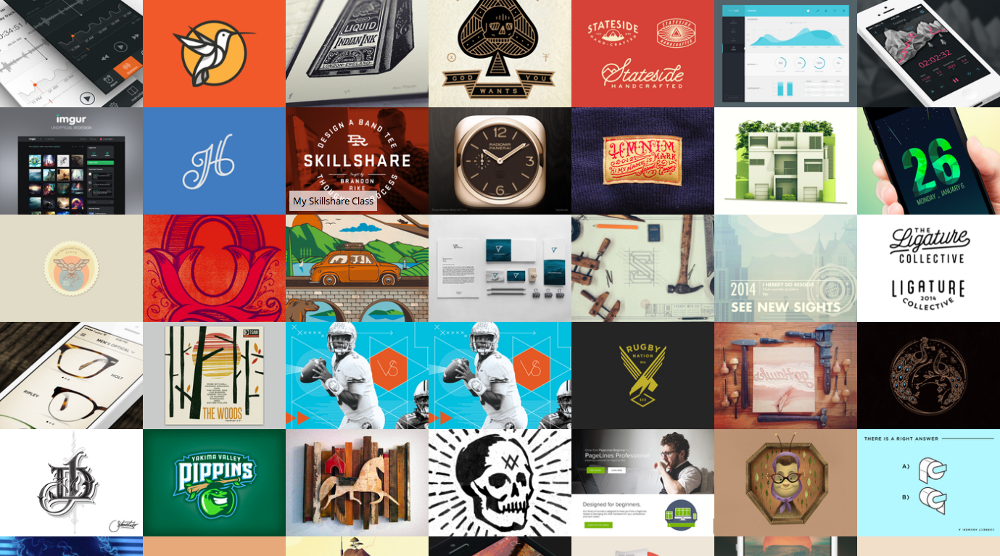

extjs-dribbble
==============

ExtJS demo app using dribbble API

Uses a basic proxy.php to call the dribbble.com API avoiding cross domain restrictions. Therefore this app needs a server with PHP to run.

More info:
http://mbudm.com/2014/01/an-extjs-demo-application/

Screenshot:

